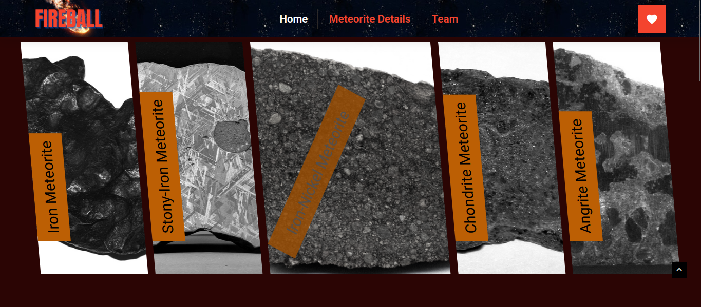
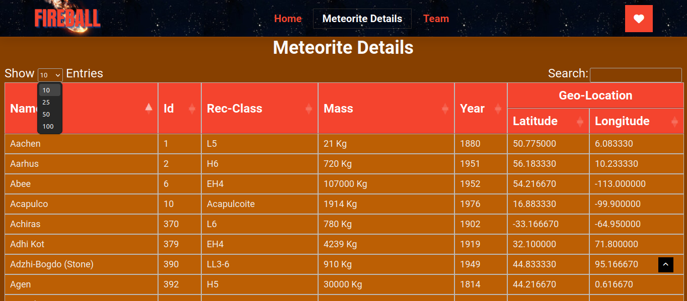

# ☄️Fireball

## 👩🏻‍💻 About the project

During the 6-week [Chingu] (https://www.chingu.io/) Voyage 45 in August and September 2023, this app was created. The program utilizes data from the NASA open API (https://data.nasa.gov/resource/gh4g-9sfh.json). This extensive data set comprises details on every known meteorite landing, according to the NASA Open Data Portal.

The goals for this project included:

- Utilizing NASA data to develop a front-end-only application.
- Using Javascript, html, css, other developing tool, or any other libraries to create the app's plans, designs, and code.
- Strictly avoid using AI-based solution generators like GitHub CoPilot in the app's development.
- To create a minimum viable product (MVP) that has a landing page with the following information:
  - The history of meteorite strikes is displayed in a detail data display.
  - Users' ability to modify a particular data display using search fields
  - A component of summary metrics that visualizes the data

Our team had goals for the application's functionality as well as for gaining experience working with a global, remote team of developers and an UI/UX designer:

- To try learning required languages and tools to build the application.
- To coordinate the work of a global, remote team of developers and UI/UX designers.

## 🧑🏾‍🤝‍🧑🏼 Our hardworking Team

- [Swastik Chakravorty](https://github.com/swastik-chakravorty)
- [KingZlo](https://github.com/)
- [Moriah](https://github.com/)

## ✅ Features of the project

- Detailed meteorite data display with search filters
- A searchable, interactive table of meteorite data
- Image gallaries of meteorite

## 🔧 Tools & Dependencies

To plan and manage our workflow, we used:

- Figma
- VS Code
- Discord channel

To build the application, we used:

- HTML
- CSS
- JavaScript
- jQuery
- API
- JSON[package-lock.json] [package.json]

## 🖥️ To run the App

1. Clone this repo.

```
git clone https://github.com/chingu-voyages/v45-tier1-team-07.git
```

2. Navigate to the project directory.

```
https://github.com/chingu-voyages/v45-tier1-team-07
```

3. Then navigate to the app within the project.

```
cd fireball
```

4. Install the dependencies.

```
npm install
```

```
jquery install
```

## 👀 App Demo

1. Meteorites Gallery



2. Meteorites Searching and Sorting Table



3. Team Members


